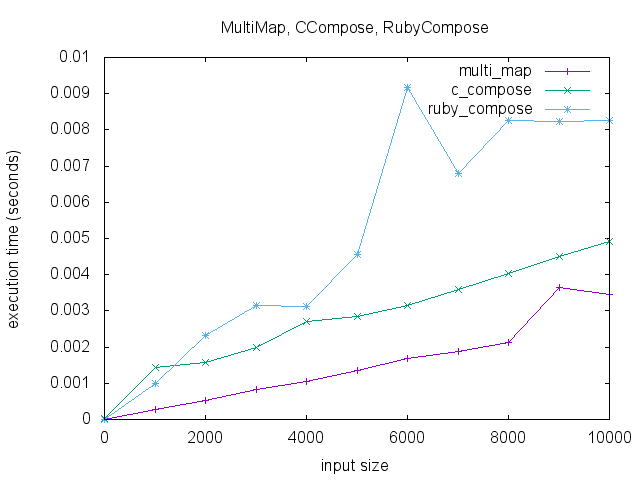

```

 ___|)___________________________________________________________
|___/____________________________________________________________
|__/|____________________________________________________________
|_/(|,\__________________________________________________________
|_\_|_/__________________________________________________________
|   |
| (_|
|
|________________________________________________________________
|__/___\_._______________________________________________________
|__\___|_._______________________________________________________
|_____/__________________________________________________________
|____/___________________________________________________________ ejm

```

# Proc#compose

This gem does just one thing: it adds `compose` to `Proc`, with the alias `*`. Based on [this experiment](https://github.com/mooreniemi/compose). It performs just a _little_ worse than chaining `map`'d blocks, and currently does **not** [preserve lambdas](http://culttt.com/2015/05/13/what-are-lambdas-in-ruby/) ([they are coerced into `Proc`](spec/proc_compose_spec.rb#L35)).



## Installation

Add this line to your application's Gemfile:

```ruby
gem 'proc_compose'
```

And then execute:

    $ bundle

Or install it yourself as:

    $ gem install proc_compose

## Usage

First things first:

```ruby
require 'proc_compose'
```

Now, given two [Proc](https://ruby-doc.org/core-2.2.0/Proc.html) objects, say:

```ruby
double = proc {|a| a * 2 }
triple = proc {|a| a * 3 }
```

We can compose them:

```ruby
(double * triple).(2)
=> 12
```

So you can do things like this:

```ruby
[1, 2, 3, 4, 5].map(&(double * triple))
=> [6, 12, 18, 24, 30]
```

Neat!

## Alternatives

You can write your [own version in Ruby](http://mooreniemi.github.io/2016/09/18/combinators.html), or use [funkify](https://github.com/banister/funkify). Though its [performance is worse](https://github.com/mooreniemi/experiments/blob/master/lib/funkify.rb) it is pure Ruby and you get some really nice other stuff like `>=` and `|`!

## Contributing

Bug reports and pull requests are welcome on GitHub at https://github.com/mooreniemi/proc_compose. This project is intended to be a safe, welcoming space for collaboration, and contributors are expected to adhere to the [Contributor Covenant](http://contributor-covenant.org) code of conduct.


## License

The gem is available as open source under the terms of the [MIT License](http://opensource.org/licenses/MIT).

